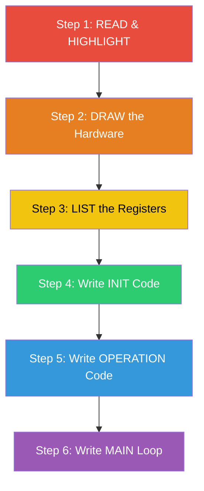
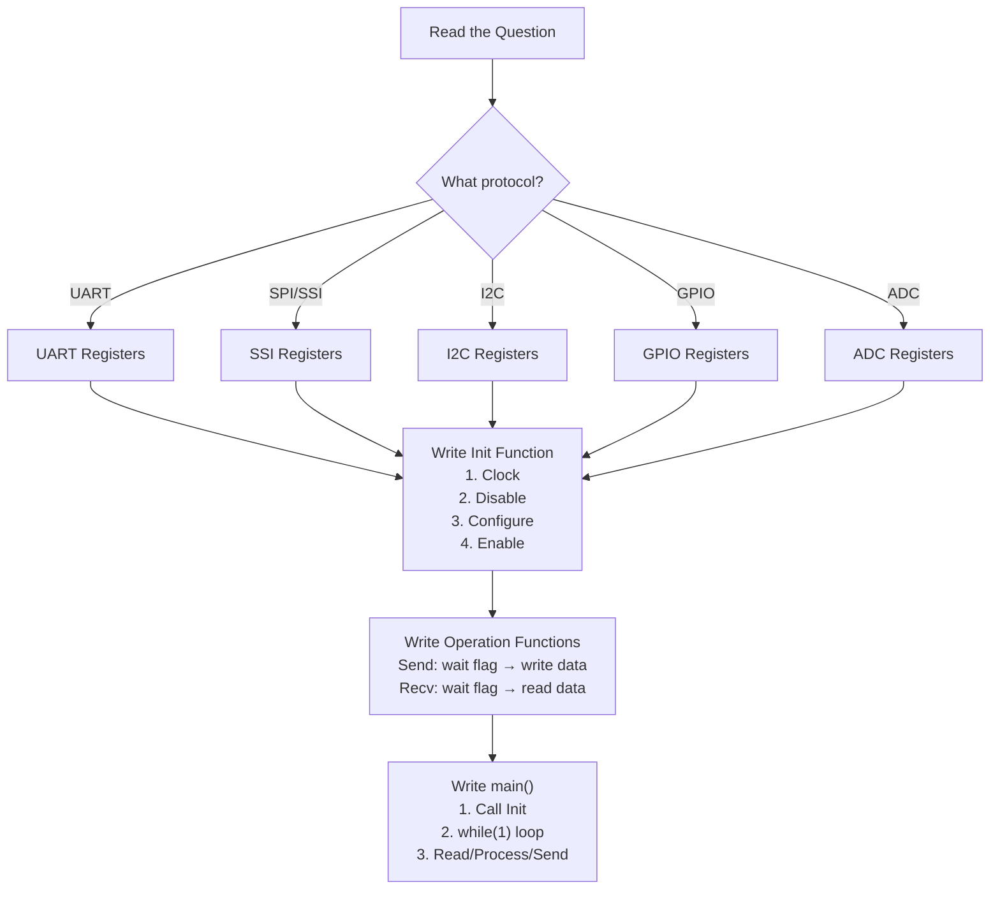
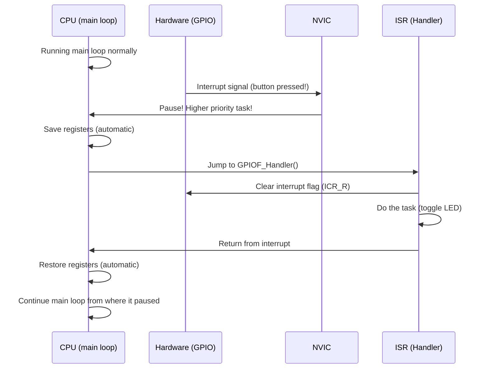

# 🧠 How to Think & Write Embedded Code in Exams

## The Core Problem

You read the question, you *understand* what it wants, but your mind goes blank when you try to write the code. This happens because you're trying to do everything at once. The solution is to **break the problem into tiny, mechanical steps** that you follow every single time.

---

## The 6-Step Method (Use This EVERY Time)



---

## Step 1: READ & HIGHLIGHT the Question 🔍

> **Goal:** Extract exactly what the question is asking. Don't start writing code yet!

Read the question **twice**. On the second read, underline or circle these things:

| What to find | Why it matters |
|---|---|
| **Which microcontroller?** | Tells you which register names to use |
| **Which peripheral?** (UART, SPI, I2C, GPIO, Timer) | Tells you which module to configure |
| **Which pins/ports?** | Tells you which port to enable |
| **What data?** (temperature, distance, characters) | Tells you what to send/receive |
| **What baud rate / speed?** | Tells you the configuration values |
| **What direction?** (send, receive, or both) | Tells you if TX, RX, or both |
| **Any special conditions?** (interrupts, polling, threshold) | Tells you extra logic needed |

### Example of highlighting:

> *"Write a program for the **Tiva C (TM4C123)** to send **temperature readings** via **UART0** at **9600 baud** to a **PC**. The **LM35** sensor is connected to **PE3 (ADC)**. Send the temperature every **1 second**."*

From this, I extract:
- **MCU:** Tiva C TM4C123
- **Communication:** UART0 (TX)
- **Sensor:** ADC on PE3
- **Baud rate:** 9600
- **Timing:** Every 1 second
- **Direction:** Sending (TX only)

---

## Step 2: DRAW the Hardware 🎨

> **Goal:** Visualize what is connected to what. This prevents pin mistakes.

Even a rough sketch helps. Draw:
1. The microcontroller in the center
2. Each peripheral connected to its specific pin
3. Label the pins with their function

```
                    TM4C123
                 ┌───────────┐
    LM35 ──────►│ PE3 (AIN0) │          
                 │            │          
    PC (TX) ◄───│ PA1 (U0TX) │          
    PC (RX) ───►│ PA0 (U0RX) │          
                 └───────────┘
```

> [!TIP]
> This drawing tells you exactly which ports to enable: **Port A** (for UART) and **Port E** (for ADC). Many students forget to enable a port — this drawing prevents that.

---

## Step 3: LIST the Registers You Need 📋

> **Goal:** Before writing any code, write down every register you'll touch. This is your "recipe."

For **any** embedded peripheral, the configuration always follows this universal pattern:

```
1. Enable the CLOCK to the peripheral
2. Configure the PINS (direction, alternate function, digital/analog)
3. Configure the PERIPHERAL itself (baud rate, data bits, mode, etc.)
4. Enable the PERIPHERAL
```

### Register Checklist for Common Protocols:

#### GPIO (Digital I/O)
```
SYSCTL_RCGCGPIO_R    → Enable clock to port
GPIO_PORTx_DIR_R     → Set pin direction (1=output, 0=input)
GPIO_PORTx_DEN_R     → Enable digital function
GPIO_PORTx_DATA_R    → Read/write pin data
```

#### UART
```
SYSCTL_RCGCUART_R    → Enable clock to UART module
SYSCTL_RCGCGPIO_R    → Enable clock to GPIO port (for TX/RX pins)
GPIO_PORTx_AFSEL_R   → Enable alternate function on TX/RX pins
GPIO_PORTx_PCTL_R    → Select UART as the alternate function
GPIO_PORTx_DEN_R     → Enable digital on TX/RX pins
UART0_CTL_R          → Disable UART before config
UART0_IBRD_R         → Integer part of baud rate divisor
UART0_FBRD_R         → Fractional part of baud rate divisor
UART0_LCRH_R         → Line control (data bits, parity, FIFO)
UART0_CTL_R          → Enable UART after config
```

#### SPI (SSI)
```
SYSCTL_RCGCSSI_R     → Enable clock to SSI module
SYSCTL_RCGCGPIO_R    → Enable clock to GPIO port
GPIO_PORTx_AFSEL_R   → Enable alternate function
GPIO_PORTx_PCTL_R    → Select SSI function
GPIO_PORTx_DEN_R     → Digital enable
SSI0_CR1_R           → Disable SSI, set master/slave
SSI0_CC_R            → Clock source
SSI0_CPSR_R          → Clock prescaler
SSI0_CR0_R           → Data size, frame format, clock rate
SSI0_CR1_R           → Enable SSI
```

#### I2C
```
SYSCTL_RCGCI2C_R     → Enable clock to I2C module
SYSCTL_RCGCGPIO_R    → Enable clock to GPIO port
GPIO_PORTx_AFSEL_R   → Alternate function on SDA/SCL
GPIO_PORTx_PCTL_R    → Select I2C function
GPIO_PORTx_DEN_R     → Digital enable
GPIO_PORTx_ODR_R     → Open drain on SDA pin (IMPORTANT for I2C!)
I2C0_MCR_R           → Master function enable
I2C0_MTPR_R          → Timer period (sets speed: 100kHz or 400kHz)
```

#### ADC
```
SYSCTL_RCGCADC_R     → Enable clock to ADC module
SYSCTL_RCGCGPIO_R    → Enable clock to GPIO port
GPIO_PORTx_AFSEL_R   → Alternate function
GPIO_PORTx_DEN_R     → DISABLE digital (clear the bit!)
GPIO_PORTx_AMSEL_R   → Enable ANALOG function
ADC0_ACTSS_R         → Disable sequencer before config
ADC0_EMUX_R          → Trigger source
ADC0_SSMUXn_R        → Input channel selection
ADC0_SSCTLn_R        → Sample control (end, interrupt enable)
ADC0_ACTSS_R         → Enable sequencer
```

> [!IMPORTANT]
> **You don't need to memorize every register address.** In exams, you usually get a datasheet extract or can use symbolic names. Focus on memorizing the **sequence** and **purpose** of each register.

---

## Step 4: Write the INIT (Initialization) Function ⚙️

> **Goal:** Turn your register list into actual C code. This is the most mechanical part — just translate the list.

### The Golden Rules of Init:

1. **Always enable the clock FIRST** and add a small delay after
2. **Disable the peripheral** before configuring it
3. **Configure all settings** while disabled
4. **Enable the peripheral** last

### Template:

```c
void UART0_Init(void) {
    // 1. Enable clocks
    SYSCTL_RCGCUART_R |= 0x01;      // UART0 clock
    SYSCTL_RCGCGPIO_R |= 0x01;      // Port A clock
    while ((SYSCTL_PRUART_R & 0x01) == 0) {}  // Wait for clock
    
    // 2. Disable UART before config
    UART0_CTL_R &= ~0x01;           // Clear UARTEN bit
    
    // 3. Configure baud rate (9600 @ 16MHz)
    //    BRD = 16,000,000 / (16 × 9600) = 104.1667
    //    IBRD = 104
    //    FBRD = integer(0.1667 × 64 + 0.5) = 11
    UART0_IBRD_R = 104;
    UART0_FBRD_R = 11;
    
    // 4. Configure line control: 8-bit, no parity, 1 stop, FIFO enabled
    UART0_LCRH_R = 0x70;            // 0111 0000
    
    // 5. Configure GPIO pins for UART (PA0=RX, PA1=TX)
    GPIO_PORTA_AFSEL_R |= 0x03;     // Alt function on PA0, PA1
    GPIO_PORTA_PCTL_R  = (GPIO_PORTA_PCTL_R & ~0xFF) | 0x11; // UART function
    GPIO_PORTA_DEN_R   |= 0x03;     // Digital enable
    
    // 6. Enable UART
    UART0_CTL_R |= 0x301;           // Enable UART, TX, RX
}
```

> [!TIP]
> ### How to Calculate Baud Rate Divisor (They ALWAYS ask this!)
> ```
> BRD = System_Clock / (16 × Baud_Rate)
> 
> Example: 16 MHz clock, 9600 baud:
>   BRD = 16,000,000 / (16 × 9600) = 104.1667
>   
>   IBRD = 104          (integer part)
>   FBRD = int(0.1667 × 64 + 0.5) = 11   (fractional part)
> ```
> **Always show your calculation in the exam — you get marks for it even if the code has a small error!**

---

## Step 5: Write the OPERATION Functions 🔄

> **Goal:** Write the functions that actually send/receive data.

### For UART — Sending a Character:

```c
void UART0_SendChar(char c) {
    while ((UART0_FR_R & 0x20) != 0) {}  // Wait until TX FIFO not full
    UART0_DR_R = c;                       // Write character to data register
}
```

**How to remember this:**
- Before sending, ask: *"Is the mailbox full?"* → Check the flag register
- If full, **wait**
- If not full, **put your letter in** → Write to data register

### For UART — Receiving a Character:

```c
char UART0_RecvChar(void) {
    while ((UART0_FR_R & 0x10) != 0) {}  // Wait until RX FIFO not empty
    return (char)(UART0_DR_R & 0xFF);     // Read character from data register
}
```

**How to remember this:**
- Before receiving, ask: *"Is the mailbox empty?"* → Check the flag register
- If empty, **wait**
- If not empty, **take the letter out** → Read from data register

### For UART — Sending a String:

```c
void UART0_SendString(char *str) {
    while (*str) {                   // Loop until null terminator
        UART0_SendChar(*str);        // Send each character
        str++;                       // Move to next character
    }
}
```

### For ADC — Reading a Value:

```c
unsigned int ADC0_Read(void) {
    ADC0_PSSI_R = 0x08;                            // Start sampling on SS3
    while ((ADC0_RIS_R & 0x08) == 0) {}             // Wait for conversion
    unsigned int result = ADC0_SSFIFO3_R & 0xFFF;   // Read 12-bit result
    ADC0_ISC_R = 0x08;                              // Clear completion flag
    return result;
}
```

> [!NOTE]
> ### The Universal Send/Receive Pattern
> Every communication protocol follows the same logical pattern:
> ```
> SEND:  Wait until "ready to send" flag → Write data to TX register
> RECV:  Wait until "data available" flag → Read data from RX register
> ```
> The only thing that changes between UART, SPI, and I2C is **which register** and **which flag bit** you check. The logic is identical!

---

## Step 6: Write the MAIN Function 🏁

> **Goal:** Tie everything together with your application logic.

```c
#include "tm4c123gh6pm.h"
#include <stdio.h>

// ... (init and operation functions from above) ...

void delay_ms(int ms) {
    int i, j;
    for (i = 0; i < ms; i++)
        for (j = 0; j < 3180; j++) {}  // Approximate 1ms at 16MHz
}

int main(void) {
    // 1. Initialize all peripherals
    UART0_Init();
    ADC0_Init();
    
    // 2. Application loop
    while (1) {
        // Read sensor
        unsigned int adc_value = ADC0_Read();
        
        // Convert to temperature (LM35: 10mV/°C, 3.3V ref, 12-bit ADC)
        // temp = adc_value × 3.3 × 100 / 4096
        unsigned int temp = (adc_value * 330) / 4096;
        
        // Format and send via UART
        char buffer[20];
        sprintf(buffer, "Temp: %d C\r\n", temp);
        UART0_SendString(buffer);
        
        // Wait 1 second
        delay_ms(1000);
    }
}
```

---

## 🗺️ The Complete Mental Map

When you see an exam question, your brain should follow this flowchart:



---

## ✅ Exam Checklist (Use Before Submitting)

Go through this list to catch common mistakes:

- [ ] Did I enable the **clock** for every port AND peripheral I'm using?
- [ ] Did I add a **delay** or check after enabling clocks?
- [ ] Did I **disable** the peripheral before configuring it?
- [ ] Did I set **AFSEL** (alternate function) for communication pins?
- [ ] Did I set **PCTL** to the correct function number?
- [ ] Did I set **DEN** for digital pins? (Or **AMSEL** + clear DEN for analog?)
- [ ] Did I **re-enable** the peripheral after configuration?
- [ ] Did I check the correct **flag bits** before sending/receiving?
- [ ] Does my `main()` have a `while(1)` infinite loop?
- [ ] Did I show my **baud rate calculation**?

---

## 📝 Full Worked Example

### Exam Question:
> *"Write a C program for the TM4C123 microcontroller that reads temperature from an LM35 sensor connected to PE3 (AIN0) and transmits the temperature value via UART0 at 9600 baud rate to a terminal. The system clock is 16 MHz. Use 8-bit data, no parity, 1 stop bit. Send the reading every second."*

### My Thinking Process (Out Loud):

**Step 1 — I highlight:**
- TM4C123 → I know the register names
- LM35 on PE3 (AIN0) → I need ADC, Port E, channel 0
- UART0 → I need UART0, Port A (PA0/PA1)
- 9600 baud, 16 MHz → I need to calculate BRD
- 8N1 → LCRH = 0x60 or 0x70 (with FIFO)
- Every 1 second → simple delay loop

**Step 2 — I draw:**
```
LM35 → PE3 (AIN0) → ADC0 → [MCU] → UART0 TX (PA1) → PC Terminal
```
Ports needed: Port A, Port E

**Step 3 — I list registers:**
```
ADC:  RCGCADC, RCGCGPIO(E), AFSEL, DEN(clear), AMSEL, ACTSS, EMUX, SSMUX3, SSCTL3, ACTSS
UART: RCGCUART, RCGCGPIO(A), AFSEL, PCTL, DEN, CTL, IBRD, FBRD, LCRH, CTL
```

**Step 4, 5, 6 — I write the code:**

```c
#include "tm4c123gh6pm.h"

/*=============================================
 * STEP 4a: ADC Initialization
 *=============================================*/
void ADC0_Init(void) {
    // Enable clocks
    SYSCTL_RCGCADC_R  |= 0x01;       // ADC0 clock ON
    SYSCTL_RCGCGPIO_R |= 0x10;       // Port E clock ON
    while ((SYSCTL_PRGPIO_R & 0x10) == 0) {}  // Wait
    
    // Configure PE3 as analog input
    GPIO_PORTE_AFSEL_R |= 0x08;      // Alt function on PE3
    GPIO_PORTE_DEN_R   &= ~0x08;     // DISABLE digital on PE3
    GPIO_PORTE_AMSEL_R |= 0x08;      // ENABLE analog on PE3
    
    // Configure ADC0, Sequencer 3 (single sample)
    ADC0_ACTSS_R &= ~0x08;           // Disable SS3
    ADC0_EMUX_R  &= ~0xF000;         // Software trigger
    ADC0_SSMUX3_R = 0x00;            // Channel 0 (AIN0 = PE3)
    ADC0_SSCTL3_R = 0x06;            // IE0 + END0 (one sample, interrupt flag)
    ADC0_ACTSS_R |= 0x08;            // Enable SS3
}

/*=============================================
 * STEP 4b: UART Initialization
 *=============================================*/
void UART0_Init(void) {
    // Enable clocks
    SYSCTL_RCGCUART_R |= 0x01;       // UART0 clock ON
    SYSCTL_RCGCGPIO_R |= 0x01;       // Port A clock ON
    while ((SYSCTL_PRUART_R & 0x01) == 0) {}  // Wait
    
    // Disable UART0
    UART0_CTL_R &= ~0x01;
    
    // Baud rate: 16,000,000 / (16 × 9600) = 104.1667
    UART0_IBRD_R = 104;              // Integer part
    UART0_FBRD_R = 11;               // Fractional: int(0.1667 × 64 + 0.5) = 11
    
    // 8-bit, no parity, 1 stop bit, FIFO enabled
    UART0_LCRH_R = 0x70;
    
    // Configure PA0 (RX) and PA1 (TX)
    GPIO_PORTA_AFSEL_R |= 0x03;
    GPIO_PORTA_PCTL_R   = (GPIO_PORTA_PCTL_R & ~0xFF) | 0x11;
    GPIO_PORTA_DEN_R   |= 0x03;
    
    // Enable UART0 + TX + RX
    UART0_CTL_R = 0x301;
}

/*=============================================
 * STEP 5a: ADC Read Operation
 *=============================================*/
unsigned int ADC0_Read(void) {
    ADC0_PSSI_R = 0x08;                          // Start conversion on SS3
    while ((ADC0_RIS_R & 0x08) == 0) {}           // Wait for completion
    unsigned int result = ADC0_SSFIFO3_R & 0xFFF; // Get 12-bit result
    ADC0_ISC_R = 0x08;                            // Clear flag
    return result;
}

/*=============================================
 * STEP 5b: UART Send Operations
 *=============================================*/
void UART0_SendChar(char c) {
    while (UART0_FR_R & 0x20) {}      // Wait if TX FIFO full
    UART0_DR_R = c;
}

void UART0_SendString(char *str) {
    while (*str) {
        UART0_SendChar(*str);
        str++;
    }
}

/*=============================================
 * STEP 5c: Helper — Simple Delay
 *=============================================*/
void delay_ms(unsigned int ms) {
    unsigned int i, j;
    for (i = 0; i < ms; i++)
        for (j = 0; j < 3180; j++) {} // ~1ms at 16 MHz
}

/*=============================================
 * STEP 6: Main Program
 *=============================================*/
int main(void) {
    unsigned int adc_value;
    unsigned int temperature;
    
    // Initialize peripherals
    ADC0_Init();
    UART0_Init();
    
    UART0_SendString("System Ready\r\n");
    
    while (1) {
        // 1. Read ADC
        adc_value = ADC0_Read();
        
        // 2. Convert to temperature
        //    LM35: 10mV per °C
        //    ADC: 0-4095 maps to 0-3.3V
        //    Voltage = adc_value × 3.3 / 4096
        //    Temp = Voltage / 0.01 = Voltage × 100
        //    Temp = adc_value × 330 / 4096
        temperature = (adc_value * 330) / 4096;
        
        // 3. Send via UART
        //    Convert number to characters manually
        //    (in case sprintf is not allowed in exam)
        UART0_SendString("Temp: ");
        UART0_SendChar((temperature / 10) + '0');   // Tens digit
        UART0_SendChar((temperature % 10) + '0');   // Units digit
        UART0_SendString(" C\r\n");
        
        // 4. Wait 1 second
        delay_ms(1000);
    }
}
```

---

## ⏱️ SysTick Timer — The Built-in Countdown Timer

> **What is SysTick?** It's a 24-bit countdown timer built into the ARM Cortex-M4 core. Every TM4C123 has it. It's the simplest timer — no modules to enable, no GPIO pins needed. Perfect for generating precise delays and periodic interrupts.

### Step 3 (SysTick): LIST the Registers 📋

```
NVIC_ST_CTRL_R    → Control & status register (enable, interrupt, clock source)
NVIC_ST_RELOAD_R  → The value to count DOWN from (reload value)
NVIC_ST_CURRENT_R → Current count value (write anything to clear it)
```

> [!TIP]
> **Memory trick:** Think of SysTick as an egg timer:
> - `RELOAD` = how many seconds you set the timer for
> - `CURRENT` = how many seconds are left on the display
> - `CTRL` = the start/stop/alarm button

### Step 4 (SysTick): INIT Code ⚙️

**SysTick does NOT need a clock enable!** It's always powered. Just configure and go.

```c
void SysTick_Init(void) {
    NVIC_ST_CTRL_R    = 0;           // Step 1: DISABLE SysTick before config
    NVIC_ST_RELOAD_R  = 15999999;    // Step 2: Set reload value
                                     //   For 1-second delay @ 16 MHz:
                                     //   RELOAD = (16,000,000 / 1) - 1 = 15,999,999
    NVIC_ST_CURRENT_R = 0;           // Step 3: Clear the current counter
    NVIC_ST_CTRL_R    = 0x05;        // Step 4: Enable with system clock
                                     //   Bit 2 = 1: use system clock
                                     //   Bit 1 = 0: no interrupt (polling mode)
                                     //   Bit 0 = 1: enable SysTick
}
```

> [!IMPORTANT]
> ### How to Calculate the RELOAD Value (They ALWAYS ask this!)
> ```
> RELOAD = (System_Clock / Desired_Frequency) - 1
>
> For a 1-second period @ 16 MHz:
>   RELOAD = (16,000,000 / 1) - 1 = 15,999,999
>
> For a 1 ms delay @ 16 MHz:
>   RELOAD = (16,000,000 / 1000) - 1 = 15,999
>
> For a 500 µs delay @ 16 MHz:
>   RELOAD = (16,000,000 / 2000) - 1 = 7,999
> ```
> **Always show this formula in the exam — it's easy marks!**

### CTRL Register Bit Values (Memorize These!)

| CTRL Value | Meaning |
|---|---|
| `0x05` | Enable + System Clock (polling mode, NO interrupt) |
| `0x07` | Enable + System Clock + **Interrupt enabled** |
| `0x00` | Disabled |

> **Bit layout of NVIC_ST_CTRL_R:**
> - Bit 0 = ENABLE (1 = on)
> - Bit 1 = INTEN (1 = trigger interrupt when reaches 0)
> - Bit 2 = CLK_SRC (1 = system clock, 0 = external clock)
> - Bit 16 = COUNT (read-only flag: 1 = timer has reached 0 since last read)

### Step 5 (SysTick): OPERATION Functions 🔄

#### Polling Mode — Wait for the count to reach zero:

```c
void SysTick_Wait(unsigned long delay) {
    NVIC_ST_RELOAD_R  = delay - 1;  // Load the delay value
    NVIC_ST_CURRENT_R = 0;          // Clear counter
    NVIC_ST_CTRL_R    = 0x05;       // Enable with system clock, no interrupt
    // Wait until COUNT flag (bit 16) is set — meaning timer hit 0
    while ((NVIC_ST_CTRL_R & 0x00010000) == 0) {}
}

// Wrapper: delay in milliseconds (@ 16 MHz)
void SysTick_Wait1ms(unsigned long delay_ms) {
    unsigned long i;
    for (i = 0; i < delay_ms; i++) {
        SysTick_Wait(16000);         // 16,000 cycles = 1 ms @ 16 MHz
    }
}
```

#### Interrupt Mode — SysTick fires the ISR periodically:

```c
// In Init: use CTRL = 0x07 to enable interrupt
void SysTick_Init_Interrupt(unsigned long period) {
    NVIC_ST_CTRL_R    = 0;           // Disable first
    NVIC_ST_RELOAD_R  = period - 1;  // Set period
    NVIC_ST_CURRENT_R = 0;           // Clear counter
    NVIC_ST_CTRL_R    = 0x07;        // Enable + system clock + INTERRUPT
}

// The ISR — this function is called automatically every period
void SysTick_Handler(void) {
    // Your periodic task goes here
    // Example: toggle an LED every 1 second
    GPIO_PORTF_DATA_R ^= 0x04;       // Toggle PF2 (blue LED)
}
```

> [!NOTE]
> The function **must** be named `SysTick_Handler` — this is the name the ARM Cortex-M4 startup file looks for in the vector table. Do NOT rename it.

---

## ⚡ Interrupts — Making the MCU React to Events

> **What are Interrupts?** Instead of constantly checking (polling) if something happened, interrupts let the hardware *notify* the CPU automatically. The CPU stops what it's doing, runs the Interrupt Service Routine (ISR), then returns to where it left off.

### The Key Concepts:

| Concept | Plain English |
|---|---|
| **ISR (Interrupt Service Routine)** | The function that runs when the interrupt fires |
| **NVIC (Nested Vector Interrupt Controller)** | The ARM hardware that manages which interrupts are enabled and their priority |
| **Edge-triggered** | Fires when the signal CHANGES (rising or falling edge) |
| **Level-triggered** | Fires as long as the signal IS at a certain level |
| **Priority** | Which interrupt wins if two fire at the same time (0 = highest) |

### Step 3 (Interrupts): LIST the Registers 📋

#### For GPIO Interrupts (most common in exams):
```
GPIO_PORTx_IS_R     → Interrupt Sense (0=edge, 1=level)
GPIO_PORTx_IBE_R    → Interrupt Both Edges (1=both edges trigger)
GPIO_PORTx_IEV_R    → Interrupt Event (0=falling edge/low, 1=rising edge/high)
GPIO_PORTx_ICR_R    → Interrupt Clear Register (write 1 to clear the flag)
GPIO_PORTx_IM_R     → Interrupt Mask (1=unmask/enable the interrupt for that pin)

NVIC_ENx_R          → NVIC Enable Register (enable interrupt in NVIC)
NVIC_PRIx_R         → Priority Register (set priority 0-7)
```

#### For SysTick Interrupts:
```
NVIC_ST_CTRL_R      → Bit 1 = INTEN (enable SysTick interrupt)
(Handled automatically by the ARM core — no NVIC_EN needed)
```

### Step 4 (Interrupts): INIT Code ⚙️

#### GPIO Interrupt Example — PF4 (SW1 button on the LaunchPad):

```c
void GPIO_PORTF_Interrupt_Init(void) {
    // 1. Enable clock and configure pin as input (standard GPIO init first)
    SYSCTL_RCGCGPIO_R |= 0x20;              // Port F clock
    while ((SYSCTL_PRGPIO_R & 0x20) == 0) {}
    
    GPIO_PORTF_LOCK_R   = 0x4C4F434B;       // Unlock Port F (PF0 is locked)
    GPIO_PORTF_CR_R    |= 0x11;             // Allow changes to PF0 and PF4
    GPIO_PORTF_DIR_R   &= ~0x11;            // PF0, PF4 = inputs (buttons)
    GPIO_PORTF_PUR_R   |= 0x11;             // Pull-up resistors (buttons are active-low)
    GPIO_PORTF_DEN_R   |= 0x11;             // Digital enable
    
    // 2. Configure interrupt behavior
    GPIO_PORTF_IS_R    &= ~0x10;            // PF4: edge-triggered (not level)
    GPIO_PORTF_IBE_R   &= ~0x10;            // PF4: NOT both edges
    GPIO_PORTF_IEV_R   &= ~0x10;            // PF4: falling edge (button press = goes LOW)
    GPIO_PORTF_ICR_R   |=  0x10;            // Clear any pending interrupt on PF4
    GPIO_PORTF_IM_R    |=  0x10;            // Unmask PF4 interrupt (ENABLE it)
    
    // 3. Enable in NVIC (Port F = IRQ 30)
    NVIC_EN0_R |= (1 << 30);               // Enable IRQ 30 (GPIO Port F)
    
    // 4. Set priority (optional, 0 = highest, 7 = lowest)
    // IRQ 30 is in NVIC_PRI7_R, bits [31:29]
    NVIC_PRI7_R = (NVIC_PRI7_R & ~0xE0000000) | (0x02 << 29); // Priority 2
    
    // 5. Enable global interrupts
    __enable_irq();   // Or: EnableInterrupts(); in TivaWare
}
```

### Step 5 (Interrupts): The ISR Function 🔄

```c
// The ISR for GPIO Port F
// MUST be named exactly "GPIOF_Handler" — defined in the startup file
void GPIOF_Handler(void) {
    // 1. ALWAYS clear the interrupt flag FIRST (prevents re-triggering)
    GPIO_PORTF_ICR_R |= 0x10;              // Clear PF4 interrupt flag
    
    // 2. Do your task
    GPIO_PORTF_DATA_R ^= 0x02;             // Toggle PF1 (Red LED)
}
```

> [!CAUTION]
> **The #1 Interrupt Mistake:** Forgetting to **clear the interrupt flag** inside the ISR!
> If you don't clear it, the ISR will fire again immediately after returning — creating an infinite loop.
> **Always start your ISR by clearing the flag with `ICR_R`.**

### IRQ Numbers for TM4C123 (Common in Exams):

| Peripheral | IRQ Number | NVIC_EN Register | Bit |
|---|---|---|---|
| GPIO Port A | 0 | NVIC_EN0_R | bit 0 |
| GPIO Port B | 1 | NVIC_EN0_R | bit 1 |
| GPIO Port C | 2 | NVIC_EN0_R | bit 2 |
| GPIO Port D | 3 | NVIC_EN0_R | bit 3 |
| GPIO Port E | 4 | NVIC_EN0_R | bit 4 |
| UART0 | 5 | NVIC_EN0_R | bit 5 |
| UART1 | 6 | NVIC_EN0_R | bit 6 |
| SysTick | — | Built into core | — |
| GPIO Port F | 30 | NVIC_EN0_R | bit 30 |

### ISR Naming Convention (ARM Vector Table):

| Peripheral | ISR Function Name |
|---|---|
| GPIO Port A | `GPIOA_Handler` |
| GPIO Port B | `GPIOB_Handler` |
| GPIO Port C | `GPIOC_Handler` |
| GPIO Port D | `GPIOD_Handler` |
| GPIO Port E | `GPIOE_Handler` |
| GPIO Port F | `GPIOF_Handler` |
| UART0 | `UART0_Handler` |
| SysTick | `SysTick_Handler` |

> [!IMPORTANT]
> These names are **fixed** by the startup file (`startup_TM4C123.s`). If you name your ISR anything different, it will NEVER be called. No error, no warning — just silent failure.

### Step 6 (Interrupts): MAIN Function 🏁

```c
#include "tm4c123gh6pm.h"

void GPIO_PORTF_Interrupt_Init(void);  // Forward declarations
void GPIOF_Handler(void);

int main(void) {
    GPIO_PORTF_Interrupt_Init();       // Set up interrupt
    
    // The LED init (PF1 = Red LED output)
    GPIO_PORTF_DIR_R  |= 0x02;        // PF1 output
    GPIO_PORTF_DEN_R  |= 0x02;        // PF1 digital enable
    
    while (1) {
        // Main loop does its own work
        // The GPIOF_Handler runs automatically when SW1 is pressed
        // No need to check the button manually!
    }
}
```

### The Interrupt Flow — What Happens in Hardware:



### SysTick + Interrupt — Complete Example:

```c
#include "tm4c123gh6pm.h"

/*--- SysTick Init with Interrupt ---*/
void SysTick_Init(void) {
    NVIC_ST_CTRL_R    = 0;           // Disable
    NVIC_ST_RELOAD_R  = 15999999;    // 1 second @ 16 MHz: (16,000,000 / 1) - 1
    NVIC_ST_CURRENT_R = 0;           // Clear counter
    NVIC_ST_CTRL_R    = 0x07;        // Enable + System Clock + Interrupt
}

/*--- SysTick ISR ---*/
void SysTick_Handler(void) {
    GPIO_PORTF_DATA_R ^= 0x04;       // Toggle PF2 (Blue LED) every 1 second
}

/*--- Main ---*/
int main(void) {
    // Enable Port F clock
    SYSCTL_RCGCGPIO_R |= 0x20;
    while ((SYSCTL_PRGPIO_R & 0x20) == 0) {}
    
    // PF2 (Blue LED) = output
    GPIO_PORTF_DIR_R |= 0x04;
    GPIO_PORTF_DEN_R |= 0x04;
    
    SysTick_Init();                  // Start SysTick with interrupt
    __enable_irq();                  // Enable global interrupts
    
    while (1) {
        // CPU is free to do other things
        // LED toggles automatically every 1 second via SysTick ISR
    }
}
```

### ✅ Interrupt Exam Checklist:

- [ ] Did I configure the pin as **input** before setting up the GPIO interrupt?
- [ ] Did I set **IS_R** (edge vs level)?
- [ ] Did I set **IEV_R** (rising vs falling edge)?
- [ ] Did I **clear** any pending flag with **ICR_R** before enabling?
- [ ] Did I **unmask** the pin with **IM_R**?
- [ ] Did I enable the IRQ in **NVIC_EN0_R** (or EN1/EN2 for higher IRQ numbers)?
- [ ] Is my ISR named **exactly** as the vector table expects?
- [ ] Did I **clear the flag** as the **FIRST line** of my ISR?
- [ ] Did I call `__enable_irq()` to enable global interrupts?

---

## 🔑 Key Tricks to Remember

### 1. Number-to-Character Conversion (No sprintf needed)
```c
// To convert a digit (0-9) to its ASCII character:
char c = digit + '0';

// Example: digit = 5 → c = '5' (ASCII 53)
```

### 2. Setting a Single Bit (Without Affecting Others)
```c
REG |= (1 << bit_number);    // Set bit
REG &= ~(1 << bit_number);   // Clear bit
```

### 3. Hex to Binary Quick Reference
```
0x01 = 0000 0001    (bit 0)
0x02 = 0000 0010    (bit 1)
0x04 = 0000 0100    (bit 2)
0x08 = 0000 1000    (bit 3)
0x10 = 0001 0000    (bit 4)
0x20 = 0010 0000    (bit 5)
0x40 = 0100 0000    (bit 6)
0x80 = 1000 0000    (bit 7)
0xFF = 1111 1111    (all bits)
```

### 4. Common PCTL Values for Tiva C
```
UART = 1
SSI  = 2
I2C  = 3
Timer = 7
```

### 5. The "Sandwich" Pattern (Disable → Configure → Enable)
```c
PERIPHERAL_CTL &= ~ENABLE_BIT;   // 🍞 Top bread — disable
// ... all configuration here ...  // 🥩 Filling — settings
PERIPHERAL_CTL |= ENABLE_BIT;    // 🍞 Bottom bread — enable
```

---

## 🎯 Practice Strategy

1. **Start with UART** — it's the most commonly asked protocol
2. **Then learn GPIO** — simplest to understand
3. **Then ADC** — very commonly combined with UART
4. **Then SPI/I2C** — less common but important

For each protocol, practice writing the **Init** and **Send/Receive** functions from memory at least 3 times until you can do it without looking at notes.

> [!CAUTION]
> **The #1 exam mistake:** Forgetting to enable the clock for a port. ALWAYS start with `SYSCTL_RCGC...` for every module and port you use.
